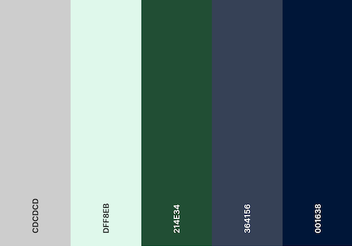
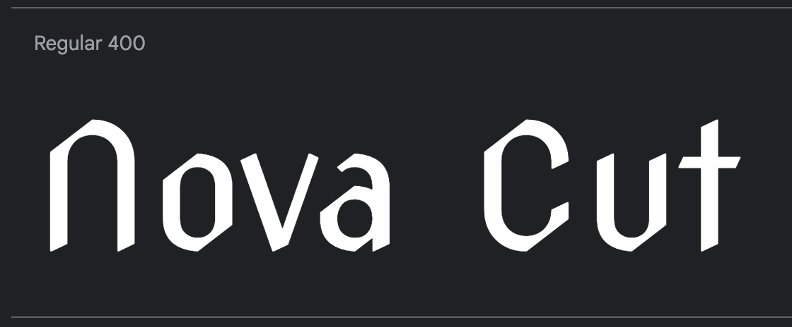
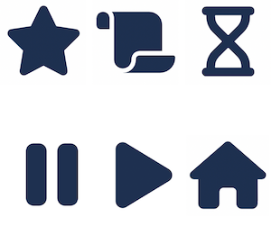
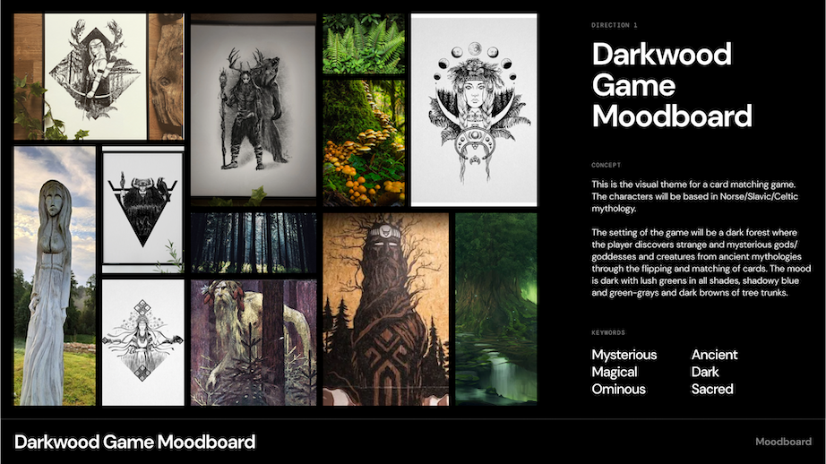
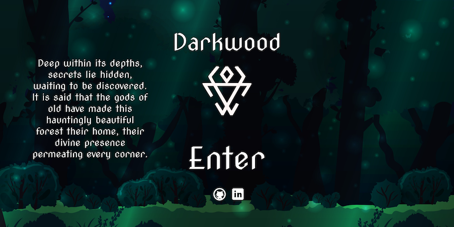
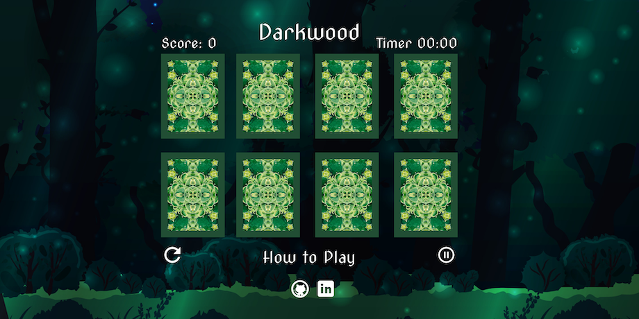
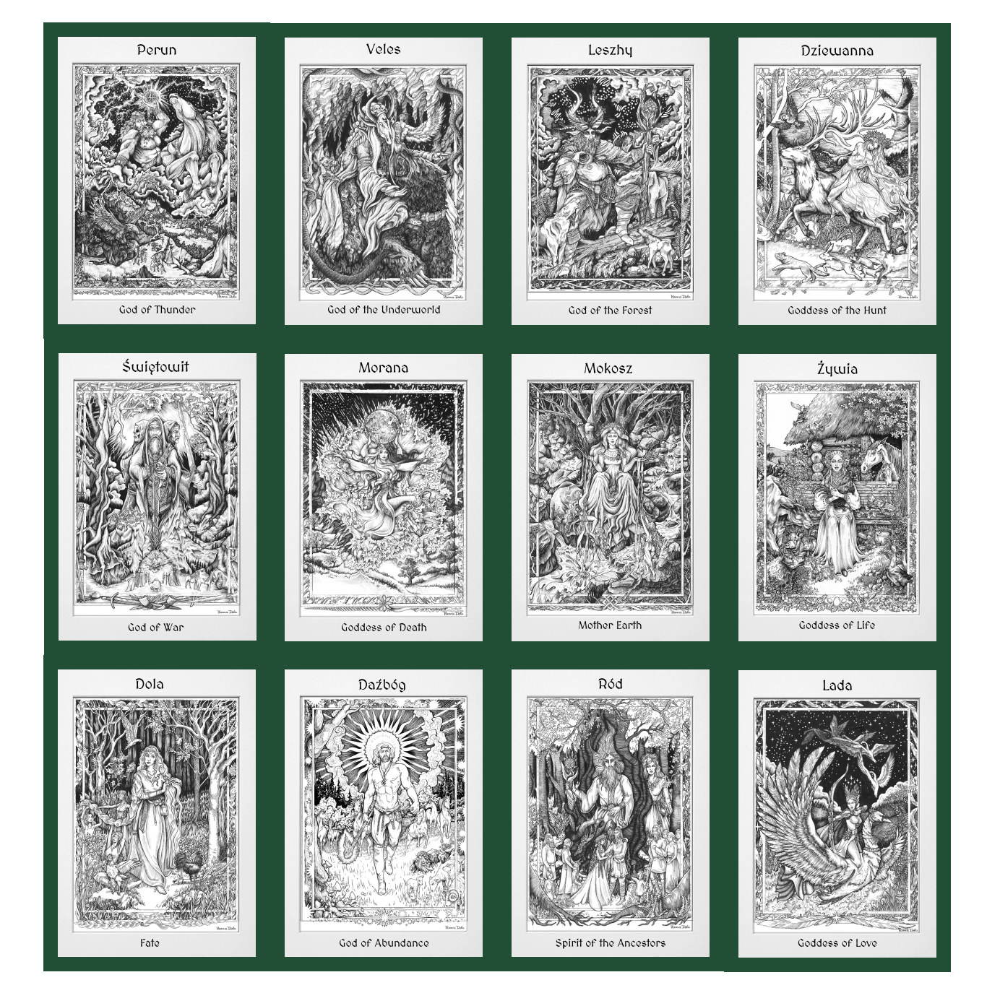
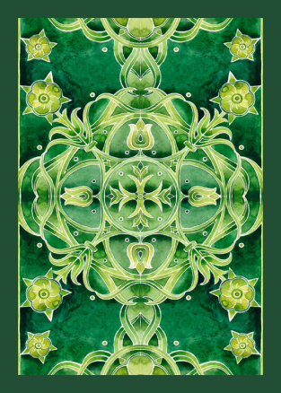
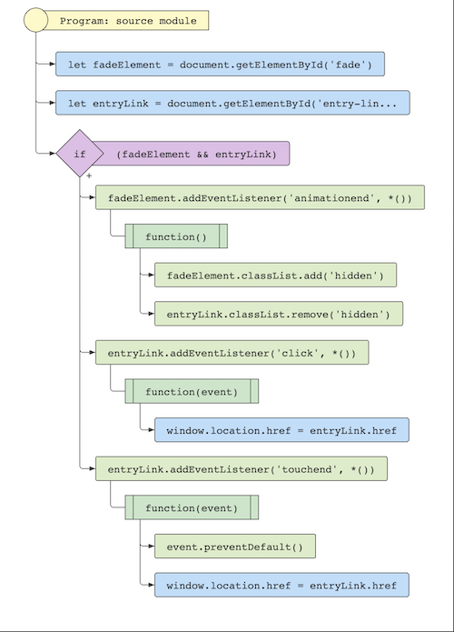

# Darkwood Readme 📚

[Link to Live Site Here](https://emidombek.github.io/darkwood/)
## 📖 Table of Contents ## 
- [Darkwood Readme 📚](#darkwood-readme-)
  - [📖 Table of Contents](#-table-of-contents)
  - [⭐ Purpose and goals of the website](#-purpose-and-goals-of-the-website)
  - [🧑 User stories](#-user-stories)
  - [🕹 Game Functionality](#-game-functionality)
    - [🃏 Card Matching](#-card-matching)
    - [⏲ Timer](#-timer)
    - [🌟 Scoring](#-scoring)
    - [🎡 Rounds](#-rounds)
  - [🗃 Content and Structure](#-content-and-structure)
  - [🖌 Design and Layout](#-design-and-layout)
    - [🌈 Design System](#-design-system)
    - [🔮 Moodboard Concept](#-moodboard-concept)
    - [🖼 Wireframes](#-wireframes)
    - [🃏 Cards](#-cards)
  - [🖥 Technology](#-technology)
  - [🤖 Code](#-code)
    - [🏢 HTML](#-html)
    - [💅 CSS](#-css)
    - [⚙ Javascript](#-javascript)
      - [🌲 graphics.js](#-graphicsjs)
      - [🎲 script.js](#-scriptjs)
  - [🚀 Deployment](#-deployment)
  - [📝 Testing](#-testing)
  

## ⭐ Purpose and goals of the website

 - The website aims to provide an immersive and educational gaming experience, engaging players with a Darkwood Slavic Mythology-themed card matching game that entertains, educates, and introduces people to the world of Slavic folklore. 
 - The game is a simple card-matching game where each matched set equals one point. The player's goal is to match all 8 cards before the timer runs out. If the player is successful they progress to the next round and continue to accumulate points for matches.
## 🧑 User stories

- As a mythology enthusiast, I want to explore and learn about Slavic folklore through a card-matching game.
- As a casual gamer, I want to enjoy a visually appealing card-matching game with a mythology theme.
- As a student studying mythology, I want to be able to learn about mythology in a fun and engaging way.
- As a parent, I want to introduce my children to Slavic mythology through a fun and educational card-matching game.
- As a player, I want to challenge my memory and cognitive skills in a mythology-themed card-matching game.

## 🕹 Game Functionality 

 ### 🃏 Card Matching
  - The game board consists of a grid of 8 cards, each with a hidden image on one side and a generic card back on the other.
  - Players can flip cards by clicking on them.
  - When two cards are flipped, the game checks if they match based on their image paths.
  - If the cards match, they remain face-up (matched).
  - If the cards don't match, they flip back face down after a brief delay.
 ### ⏲ Timer
  - The game includes a timer displayed in MM:SS format.
  - When a round starts, the timer begins counting down from the specified timeout (default is 60 seconds).
  - The timer updates every second and triggers the end of the round when it reaches zero.
 ### 🌟 Scoring
  -  The player's score is based on the number of matched pairs.
  - Each time two cards match, the score increases by one.
  - The game tracks the number of matched pairs (matchedPairs) to determine when all pairs have been found.
 ### 🎡 Rounds
 - The game consists of multiple rounds.
 - Each round increases the number of cards on the board, making it more challenging.
 - Players progress to the next round when all pairs are matched within the time limit.
 - Pause and Restart
 - The game includes buttons to pause and restart the game.
 - Clicking the pause button pauses the timer and flips all cards back to their face-down position.
 - Clicking the restart button restarts the game from round one.

## 🗃 Content and Structure

- Custom HTML, Custom CSS, CSS Flexbox, CSS variable roots, CSS Keyframes animations, Custom Javascript
- Github Repo: <https://github.com/emidombek/darkwood>
- Page structure:
     
   1. Landing Page: index.html
   
      - This is a page designed to introduce the user to the feel and atmosphere of the game and to set up the user experience. It also acts as a 'gateway' to the user providing a link to the game at the end of a short animation sequence. 

      - It consists of a Header with the Game Title. The body contains an image of a symbol and a fade-in fade-out fade-in Keyframes animation consisting of two different elements. 

      - An element with some intro text and another element with an entry link for the game. The second link element has an additional Keyframes glow animation designed to highlight and entice the user to click on it.

      - The footer contains a link to my LinkedIn profile as well as my GitHub profile.

      - There is also an animated background (canvas element + js) consisting of small 'fireflies' flying around. The js for this animation and the keyframes fade in-out effects are contained within a separate graphics.js file to the game js which is in the script.js file.  

      

       
Click here to view a screenshot of the Landing Page

       
  
       
  
       

  
   2. Game Page: game.html
   
      - The actual game is located on this page. 

      - When the user first enters the game it load with an overlay and a click-to-start mechanism. After the user clicks on the text the overlay is removed and the game starts.

      - The page itself consists of a Header with the Game Title. There is also a sub-heading container in the header that contains 3 labeled icons that are part of the game elements. These elements are the game score display, an instructions pop-up and a timer for each round.

      - The body consists of a fake 'grid' (a container with columns and rows)+ 2 rows containing, 8 dynamically generated cards in JS in pairs.
   
      - Within the game, there is a total of 16 different cards based on mythological beings from different regions (West, East and Southern Slavic Countries). Each round a new set of 4 matching pairs are placed within the game. Once the user starts the game they must match all 8 cards to progress, if the user runs out of time they will be prompted with a 
  
      - Beneath the 'card grid' there is an instructions-controls container that holds 3 additional elements: an alternating pause/play button (depending on whether the user pauses the game), a home icon with a link back to the index page and a restart button to restart the game completely.
     
      - The footer contains links to my LinkedIn and GitHub profiles.
  
      - This page also uses the same animated background as the entry page. It also uses the keyframes glowing/glow animation to highlight certain clickable icons/text. 

      

       
Click here to view a screenshot of the Game Page

       
  
       

       

       

       

## 🖌 Design and Layout

 The design and layout of this website was created in Figma. A moodboard and wireframes were designed from scratch to help develop the look and feel of the game. Keyframes animations help emphasize important links and icons. Javascript for the background and Keyframes animations are stored in a different graphics.js file than the actual game code which is located in script.js. The setting of the game is inspired by Slavic mythology and the Witcher games/tv series/books.

   ### 🌈 Design System

   

   
Click here to view the Elements of the Design System

   
   *Color Palette*

   

   *Font*

   

   Nova Cut 400 imported from [Google Fonts](https://fonts.google.com/specimen/Nova+Cut)

   *Iconography*

   

   Icons are taken from [Font Awesome](https://fontawesome.com/)

   

   ### 🔮 Moodboard Concept

   

   
Click here to view the Moodboard and Concept

   

   

  
   ### 🖼 Wireframes 

   [Link to Wireframes in Figma](https://www.figma.com/file/xfQpobp6FbpuhwTs9gPaX5/Darkwood-Memory-Card-Game?type=design&node-id=0%3A1&mode=design&t=QpLt1hLRtOcsTnLt-1)

   

   
Click here to view the Wireframes

   Landing Page Wireframe:

   

   Game page Wireframe:

   

   

   ### 🃏 Cards

   

       
Click here to view the Cards

   Entire Deck:

   

   Card Back:

   

   

   The front and back of the cards are taken from two artists under a private/personal use license, permission obtained:

   - Front (Back ingame) of the cards: *Slavic Pantheon* [Hanna Dola Art](https://www.behance.net/hannadolaart/assets)
   - Back (Front ingame) of the cards: *Playing Cards* [Losenko](https://www.deviantart.com/losenko) 
 
## 🖥 Technology

 The technology used in this project is as follows:

   - [CSS](https://en.wikipedia.org/wiki/CSS) - style sheet language used to style the webpages.
   - [HTML](https://en.wikipedia.org/wiki/HTML) - standard markup language.
   - [Javascript](https://en.wikipedia.org/wiki/JavaScript) - a programming language used on the client side of web applications.
   - [Code Institute Repo Template](https://github.com/Code-Institute-Org/ci-full-template) - GitHub repository template used to create the repository.
   - [Visual Studio Code](https://code.visualstudio.com/) - source code editor used to create, edit and publish the webpages with the assistance of Git/GitHub/GitPages.
   - [Figma](https://www.figma.com/) - cloud-based design tool I used to create the wireframes and moodboard.
   - [Git](https://en.wikipedia.org/wiki/Git) - distributed version control system.
   - [GitHub](https://github.com/) - Git repository hosting service with a web-based graphical interface.
   - [Gitpages](https://docs.github.com/en/pages/getting-started-with-github-pages/about-github-pages)- GitHub Pages is a static site hosting service.

## 🤖 Code

 The majority of this game is written in custom Javascript, with custom CSS + Keyframes animations for styling as well as custom HTML. 

   ### 🏢 HTML

   The HTML used is a pretty standard implementation for both the index.html page and the game.html it includes a Head, Header, Body and Footer for each page. The index.html serves as an entry point for the game.html displaying a p element entry text that reveals an entry link element to the user via a CSS/Javascript keyframes animation sequence. 
   
   

   
HTML index.html + game.html Summary

  
   - The game.html page has containers that hold the game features and links: a Score icon/text with a span to display the game score, an icon with a pop-up trigger that triggers a pop-up containing game instructions and a timer icon with a span that displays the time remaining in the current round at the top. The main section holds the fake 'grid' or just a container with rows and grid game rows that hold the eight cards that are generated dynamically in Javascript. Below the card containers, there is another container with some controls and a link: the play/pause icon/text is a span that is toggled via JS depending on the game state function currently active, a home icon/text that contains a link back to the index Landing Page and a restart icon/text that triggers the restart game function in JS. The social media list items in the footer of both pages were taken from the Love Running project which will be listed in the resources below.

   - A highlight of the HTML implementation of the **canvas** element on both pages which is used to facilitate the display of the background 'Firefly' Javascript animation.

   - Another highlight of the HTML is the elements on the index.html which facilitate the fade-in fade-out fade-in keyframes animation sequence.

   - The game.html page besides holding the containers for the dynamically created cards and game controls + displays and links has containers that hold several pop-ups that are further styled and controlled in the script.js file. 
    
   

   ### 💅 CSS

   The CSS for this game is pretty standard located inside the style.css file. The root variables define various colors, font families, and line height to maintain consistency throughout the game. At the top of the file it imports the Nova Cut font from google fonts.

   

   
CSS style.css Summary

   - The CSS includes global styles for the body, main, and header elements, setting the background image and layout. It also configures the **canvas** element for firefly-like graphics animation found in the graphics.js file. There is also a setting at the very top that removes global settings (credit to my mentor Juliia). There are also several media queries to ensure the site remains responsive on several different screen sizes.
  
   - Highlights of the CSS include some elements including being styled to be initially hidden to facilitate various effects:

    1. .entry-link: The "Enter" link on the entry page is initially hidden. It becomes visible later with a fade-in effect.
    2. .hidden: This class is used to hide elements. It's not directly applied to any specific element in the given CSS, but it's likely used in JavaScript or dynamically added to elements for certain interactions.
    3. .fa-play: The play icon used in pop-up elements is initially hidden.
    4. #playText: This element, likely a text label for the play icon, is initially hidden.
  
   - The CSS file also defines animations via Keyframes for fade-in and glowing effects on elements. Resources for the Keyframes animations will be listed in the resources section of this readme.
   
   

   ### ⚙ Javascript

   The Javascript in this project is divided into two different files, the first file is the *graphics.js* file where the background fireflies animation is created and Keyframes fade-in fade-out sequence is controlled. This file is used on both of the web pages. The second file script.js is where the actual code that runs the game lives. This file is only used within the game.html webpage. 

   #### 🌲 graphics.js

   The entire code is wrapped in a 'DOMContentLoaded' event listener to ensure that the JavaScript code inside the event listener and runs after the DOM has been fully loaded and parsed.

   [SVG Flowchart of the entire graphics.js file](https://github.com/emidombek/darkwood/blob/main/docs/images/graphicsjsfull.svg)

   

   
Control Fade-In Fade-Out Fade-In Animation Sequence

   

   - Initially, both fadeElement and entryLink have the "hidden" class applied to them, which sets their opacity property to 0 in the CSS, making them invisible on the webpage.

   - When the page loads and the DOMContentLoaded event fires, the JavaScript sets up an animationend event listener on fadeElement.

   - When fadeElement finishes its animation (a fade-out effect, for example), the animationend event is triggered.

   - In the event listener callback function, the JavaScript code executes and adds the "hidden" class back to fadeElement using fadeElement.classList.add("hidden");.

   - However, before this step, the code also sets up another event listener for the animationend event on entryLink.

   - When fadeElement finishes its animation, the animationend event listener on entryLink triggers as well.

   - In the event listener callback function for entryLink, the JavaScript code executes and removes the "hidden" class from entryLink using entryLink.classList.remove("hidden");.

   - By removing the "hidden" class from entryLink, the CSS transition now applies to it, and its opacity is gradually changed from 0 to 1 over time, creating the fade-in effect for the link.

   - So, both fadeElement and entryLink have separate animationend event listeners, but the removal of the "hidden" class from entryLink occurs in it's own event listener and is essential for triggering the fade-in animation for the link.  
   
   

   

   
Firefly Background Animation

   The majority of this code was taken from: https://github.com/owentr1369/animated-background-fireflies-youtube and modified.

   Summary of the code:

   1. The code defines a Firefly class that represents a firefly's behavior on a canvas. It has methods to update its position and display on the canvas (move(),show(c)).

   2. Variables canvas, context, w, and h are declared to handle the canvas and its drawing context.

   3. An array f is created to store firefly objects.

   4. The draw() function manages the animation loop for the fireflies, adding new fireflies and removing those outside the canvas.

   5. The init(elemid) function sets up the canvas, fills it with a light green color, and returns the drawing context for further drawing operations.

   6. The loop() function sets up the animation loop using window.requestAnimationFrame to repeatedly clear the canvas and render the animation.

   7. The window.resize event listener updates the canvas size when the window is resized, reinitializes the canvas, and restarts the animation loop to reflect the changes.

   8. Finally, the code initializes the canvas and starts the animation loop.

   The code creates a simulation of fireflies flying around on a canvas, and the fireflies move randomly within the canvas boundaries. The animation loop ensures a smooth visual effect, and fireflies are added or removed as needed to maintain the desired number of fireflies on the canvas.

   Here is a list of what was modified:

   1. Variable names:
      - Original: Uses c as the canvas context variable and returns it from the init function.
      - My edit: Uses context for the canvas context variable and returns it from the init function. It was easier to make sense of it going back to read it.

   2. Typo in move method: 
      - Original: Contains a typo (this.and) when updating the angle of movement, should be this.ang.
      - My edit: Fixed the typo.

   3. Mouse movement tracking: 
      - Original: The original code includes event listeners to track the mouse position and store it in mouse and last_mouse variables. Also includes mouse movement tracking using event listeners to store mouse coordinates.
      - My edit: Removed the mouse movement tracking event listeners because they were causing issues with the animation loading and I could not figure out what exactly was causing it. This also makes the animation purely self-contained and autonomous, meaning it will generate the firefly animation without any external input.

   4. Canvas initialization and animation loop:
      - Original: Uses setInterval for animation loop (60 FPS).
      - My edit: Uses window.requestAnimationFrame for animation loop. It provides a more efficient and optimized approach for achieving smooth animations while also being mindful of performance and battery life.

   5. Background fill color:
     - Original: Sets the canvas background fill color to a dark gray (rgba(30, 30, 30, 1)).
     - First Post: Sets the canvas background fill color to a light green (rgba(152, 255, 191, 1)).

   

   ####  🎲 script.js

   The entire code is wrapped in a 'DOMContentLoaded' event listener to ensure that the JavaScript code inside the event listener and runs after the DOM has been fully loaded and parsed.

   [SVG Flowchart of the script.js file](https://github.com/emidombek/darkwood/blob/main/docs/images/scriptjs.svg)

   

   
Timer & Timer Formatting

   Timer Formatting (formatTime(seconds)): Formats the timer display from total seconds to MM:SS format.

   **startTimer()**

   - This function initiates the game timer, ensuring it starts counting down properly.
   - It checks whether the timer is already active (timerActive flag) to avoid reinitialization.
   - The remaining seconds for the timer are determined based on whether the game was paused (isPaused flag) or if it's a new round (matchTimeout).
   - The timer display is updated with the remaining seconds using the updateTimerDisplay() function.
   - The timerActive flag is set to true to indicate that the timer is running.
   - If the game was paused, the timer resumes from the remainingSeconds; otherwise, the initial seconds are stored in remainingSeconds.
   - The setInterval() function is used to create a timer that decrements secondsLeft every second.
   - When secondsLeft reaches zero or less, the interval is cleared, and the endRound() function is called to conclude the current round.

   **updateTimerDisplay(element, seconds)**

   - This function updates the visual representation of the timer in the specified HTML element.
   - The formatTime() function converts the seconds parameter into an easily readable MM:SS format, where MM represents minutes and SS represents seconds, always displaying seconds with two digits (e.g., '01', '05', '10', etc.) using leading zeros if necessary.
   - The formatted time is then set as the textContent of the given element.

   **formatTime(seconds)**

   - This function takes the number of seconds as input and converts it into a user-friendly time representation.
   - It calculates the number of minutes by dividing seconds by 60 and using Math.floor() to round down to the nearest integer.
   - The remaining seconds are derived by taking the modulo (%) of seconds divided by 60.
   - The function returns a formatted string in the format MM:SS, with leading zeros added to single-digit remaining seconds.
   - Note: The idea for this came from my previous life as a data analyst when I dealt with formatting dates and times extensively. This JS function was something I tried to convert from an SQL query I wrote.
  
   

   

   
Scoring Logic

   **Scoring Logic**

   - The game uses a simple point system to calculate the player's score.
   - Each time the player successfully matches two cards, they earn one point.
   - The 'score' variable keeps track of the player's total score throughout the game.
   - When two cards are flipped, the game checks if they match by comparing their image names.
   - If the two flipped cards have the same image name (i.e., they are a matching pair), the 'score' is incremented by 1, and the cards are marked as 'matched'.
   - The 'matchedPairs' variable counts the number of pairs the player has successfully matched in the current round.
   - If the player matches all card pairs within the time limit (timer reaches zero), the round is completed, and the player proceeds to the next round.
   - At the start of each round, the 'score' and 'matchedPairs' variables are reset to 0 to prepare for the new round.
   - The game interface visually displays the player's score to provide real-time feedback as they progress through the rounds
  
   

   

   
Shuffling

   **shuffle(array)**

   - This function performs array shuffling using the Fisher-Yates algorithm to ensure randomization of the elements.
   - The array.sort() method is utilized, taking a comparator function that returns a random number in the range of -0.5 to 0.5.
   - Random sorting reorders the elements in the array, effectively shuffling the elements.
   
   

   

   
Card Creation

   The two functions, createCards(images) and createGrid(cards), work together to dynamically create and display the card grid for the game.

   **createCards(images)**

   - This function takes an array of image paths (images) as input.
   - It iterates over the first four images in the images array (as indicated by i < 4) to create card elements for the game.
   - For each image, it creates a new card element (
 element) with the class "card".
   - It extracts the image name from the image path by splitting it at the '/' and taking the last part of the split (imageName).
   - Adds a class to the card element with the name "card-image-{imageName}" to identify the card's back image.
   - Creates inner elements for the card (front and back) and appends them to the card element.
   - The front of the card contains a placeholder image with an "alt" attribute set.
   - The back of the card contains an image element with the corresponding image path from the images array and an "alt" attribute set.
   - Finally, the card element is added to an array (cards) to keep track of all created cards.
   - The function returns the array of card elements.

   

   

   
Grid Creation

   The two functions, createCards(images) and createGrid(cards), work together to dynamically create and display the card grid for the game.

   **createGrid(cards)**

   - This function takes an array of card elements (cards) as input.
   - It checks if there are existing row containers with the class "grid-game-row" on the page by querying for them using document.querySelectorAll('.grid-game-row').
   - If no row containers are found, it creates two new row containers (
 elements) and appends cards to them.
   - The first half of the cards is appended to rowContainer1, and the second half is appended to rowContainer2.
   - The row containers are then appended to the gridContainer, which represents the main container for the card grid.
   - If row containers already exist, the function clears their content by removing all child elements using a while loop.
   - After clearing the existing content, it appends the cards to the respective row containers again.
   - The function effectively creates the layout for the card grid by organizing the cards into two rows.

   

   

   
Flip Card

   **FlipCard(card)**

   - Flips a card element when it is clicked.
   - If the card is already matched, it returns without doing anything.
   - If the card is not matched, it toggles the 'flipped' class to change its appearance.

   **flipCard(clickedCard)**
   - Calls the 'flipCard' function when a card is clicked (clickedCard represents the card element that was clicked).
   - flippedCards.push(clickedCard)Adds the clickedCard to the 'flippedCards' array, which keeps track of the two cards currently flipped.
   - if (flippedCards.length === 2) Checks if there are two cards flipped (two elements in the 'flippedCards' array).
   - checkMatch()
     - Called when two cards are flipped to check if they match.
     - Compares the image names of the two flipped cards to see if they are a match.
     - If the cards match, they remain face up and are marked as 'matched'.
     - If they don't match, they are flipped back face down after a brief delay.
  
   

   

   
Check Match

   **checkMatch()**

   - Checks if the two flipped cards match based on their image names.
   - Retrieves the image names of card1 and card2 using classList and Array.from().
   - If the cards match, adds the 'matched' class to both cards, increments the score, and updates the score display using displayScore().
   - Increases the matchedPairs count, and if all pairs are matched, triggers endRound() after a brief delay.
   - If the cards don't match, flips them back by calling flipCard(card) for each card.
   - Disables card click event listeners while cards are being matched and re-enables card click event listeners after a brief delay. This is done to prevent more than 2 cards being flipped at one time.
  
   **displayScore()**

   - Retrieves the HTML element displaying the player's score.
   - Updates the element's content with the current score value.
   
   

   

   
Start Round

   Start Round (startRound(previousScore)): Sets up the game board for a new round, including shuffling and placing cards, resetting variables, and starting the timer.

   **startRound(previousScore = 0)**

   - previousScore (optional): The score from the previous round. Defaults to 0 if not provided.
   - Initializes various game-related variables: score, matchedPairs, flippedCards, timerActive, timer, and remainingSeconds.
   - Shuffles the uniqueImages array to randomize the order of images for the cards.
   - Creates card elements using the createCards() function with the shuffled images.
   - Duplicates the cards by creating clones using the map() function and cloneNode() method.
   - Combines the original and duplicated cards and shuffles them again to randomize their order.
   - Creates the game grid by calling the createGrid() function with the combined cards.
   - Initiates the timer for the round by calling the startTimer() function.
   - Updates the score display on the game screen using the displayScore() function.
   - Adds an event listener for the click event on the gridContainer, enabling the handleCardClick() function when a card is clicked.
   - 
   

   

   
End Round

   End Round (endRound()): Handles the end of a round, triggering round completion or game over popups.
   
   **endRound()**
   - Logs a message to the console indicating the end of the round.
   - Stops the timer by clearing the interval set by the setInterval() function using clearInterval(timer).
   - Checks if the number of matched card pairs (matchedPairs) is equal to half of the total number of cards (numberOfCards / 2). If true, it means all pairs have been successfully matched.
   - If all pairs are matched, it logs a congratulatory message to the console and increments the round counter by 1.
   - Displays the current round number and opens a popup (openPopup2()) after a 1-second delay to indicate the completion of the round.
   - If not all pairs are matched, it means the time ran out before matching all pairs.
   - Opens a popup (openPopup3()) to notify the player that the round is over.
   - Updates the score display on the game screen using the displayScore() function.

   

   

   
Pause, Resume, Start and Restart

   **startGame()**

   This function is called to initiate the game.

   Actions:
   - Hides the overlay element by setting its display property to 'none'. (Hides the click-to-play overlay)
   - Calls the resumeGame() function to start the game. (this is because the startRound() and pause() are called before this game in order to generate the grid behind the 'click-to-play' overlay)
  
   **restartGame()**

   This function is called to restart the game.

   Actions:
   - Logs a message indicating that the game is being restarted.
   - If the game is currently paused (isPaused is true), it toggles the play/pause button to show the play button and its text label.
   - Resets the isPaused flag to false.
   - Clears any existing timers by calling clearInterval(timer).
   - Resets the timerActive flag to false.
   - Resets the number of matched pairs (matchedPairs) to zero.
   - Empties the array storing flipped cards (flippedCards).
   - Resets the player's score to zero.
   - Resets the round number to one.
   - Sets the remaining seconds for the timer to the initial timeout value (matchTimeout).
   - Updates the timer display with the initial timeout value using the updateTimerDisplay() function.
   - Starts a new round by calling the startRound() function.
   - Updates the score display on the game screen using the displayScore() function.  

   **pauseGame()**
   This function is called to pause the game.

   Actions:
   - Sets the timerActive flag to false to pause the timer.
   - Logs a message indicating that the game is paused.
   - Clears the timer interval using clearInterval(timer) to stop the timer.
   - Removes the click event listener for card clicks on the game grid by calling gridContainer.removeEventListener('click', handleCardClick).
   - Toggles the play/pause button to show the play button and its text label.
   - Stores the remaining seconds of the timer (timerElement.textContent) in the remainingSeconds variable to track the time when the game was paused.
  
   **resumeGame()**
   This function is called to unpause the game.

   Actions:
   - Sets the timerActive flag to false.
   - Starts the timer by calling the startTimer() function.
   - Adds back the click event listener for card clicks on the game grid by calling gridContainer.addEventListener('click', handleCardClick).
   - Toggles the play/pause button to show the pause button and its text label.
   - Logs a message indicating that the game has been resumed.
  
   **togglePlayPauseButton(isPaused)**

   This function is used to toggle the display of play/pause buttons based on the game's paused state.

   Actions:
   - If the game is paused (isPaused is true), it hides the pause button and shows the play button along with their corresponding text labels.
   - If the game is not paused (isPaused is false), it hides the play button and shows the pause button along with their corresponding text labels.
  
   *Parameters:*
   isPaused: A boolean indicating whether the game is paused (true) or not (false).

   

   

   
Popup/Button/Card Click Handling

   **openPopup()**

   - This function is called to open a popup by setting the display property of popupContainer to 'block'. It also calls the pauseGame() function to pause the game when the popup is opened.

   **closePopupHandler()**

   - This function is called to close a popup by setting the display property of popupContainer to 'none'. It also calls the resumeGame() function to resume the game when the popup is closed.

   **openPopup2()**
    
   - This function is called to open a specific popup (popupContainer2). It updates the content of the popup to display the current round number. The function sets the display property of popupContainer2 to 'block' to show the popup.

   **handleClosePopup2()**

   - This function is called to close the specific popup (popupContainer2). It sets the display property of popupContainer2 to 'none' to hide the popup. The function also calls startRound(score) to start the next round with the current score.

   **openPopup3()**

   - This function is called to open a specific popup (popupContainer3). It sets the display property of popupContainer3 to 'block' to show the popup.

   **handlerestartgameButton()**
   - This function is called when the restart game button on popupContainer3 is clicked. It closes the popup (popupContainer3) by setting its display property to 'none' and then calls the restartGame() function to restart the game.

   **handleendgameButton()** 
   - This function is called when the end game button on popupContainer3 is clicked. It closes the popup (popupContainer3) by setting its display property to 'none'.

   **handleCardClick(event)**
    This function is the event listener for card clicks on the game grid. It takes an event object as a parameter.

   Actions:
   - It retrieves the clicked card element using event.target.closest('.card').
   - If no card is clicked or the clicked card is already flipped, the function returns without further action.
   - If a valid card is clicked, it calls the flipCard(clickedCard) function to flip the card.
   - The clicked card is added to the flippedCards array.
   - If two cards are flipped (the flippedCards array length is 2), it calls the checkMatch() function to check if the flipped cards match.
   
   

   

   
Event Listeners

   1. Attached to: instructionsIcon
   Triggers: When the Instructions icon is clicked.
   Action: Calls the openPopup() function to open the pop-up.
   Event Listener for Close Popup Button

   2. Attached to: closePopup
   Triggers: When the Close Popup button inside the pop-up is clicked.
   Action: Calls the closePopupHandler() function to close the pop-up.
   Event Listener for Close Popup2 Button

   3. Attached to: closePopup2
   Triggers: When the Close Popup2 button inside the second pop-up is clicked.
   Action: Calls the handleClosePopup2() function to close the second pop-up and start a new round with the current score.
   Event Listener for Restart Game Button in Popup3

   4. Attached to: restartgameButton
   Triggers: When the Restart Game button inside the third pop-up is clicked.
   Action: Calls the handlerestartgameButton() function to close the third pop-up and restart the game.
   Event Listener for End Game Button in Popup3

   5. Attached to: endgameButton
   Triggers: When the End Game button inside the third pop-up is clicked.
   Action: Calls the handleendgameButton() function to close the third pop-up.

   

   

   
Variables & Arrays

   - Initializes various variables to manage the game, such as:
   uniqueImages, score, timer, matchTimeout, timerActive, numberOfCards, round, flippedCards, matchedPairs, gridContainer, combinedCards, restartButton, pauseButton, playButton, pauseText, playText, timerElement, shuffledImages, allCards, duplicatedCards, isPaused, instructionsIcon, popupContainer, closePopup, overlay, popupContainer2, closePopup2, popupContainer3, restartgameButton, and endgameButton.

   - uniqueImages holds an array of unique image paths used in the game.
   - score represents the player's score, and timer is a reference to the game timer.
   - matchTimeout defines the time limit for each round.
   - timerActive is a flag to track if the timer is currently active.
   - numberOfCards indicates the total number of cards in the game.
   round stores the current round number.
   - flippedCards is an array to keep track of flipped cards during a round.
   - matchedPairs counts the number of matched card pairs.
   - gridContainer holds the container element for the grid of cards.
   - Various elements such as buttons, texts, and pop-up containers are selected and stored in corresponding variables.
   - isPaused is a flag to track if the game is currently paused.
  
   

## 🚀 Deployment 

  The site was deployed to GitHub pages. The steps to deploy are as follows:

  1. In the GitHub repository, on the Code page navigate to the Environments section on the right-hand side of the page.
   Click on GitHub pages, this will take you to deployments history where you will be able to click on 'view deployment'.
   The live link can be found here - [Link to Live Site Here](https://emidombek.github.io/darkwood/)

  **Local Deployment**

  *Prerequisites: Github account, Visual Studio Code, Live Server Extension for VScode.*

  1. To deploy the website locally and test it on your machine, you can follow these steps:

  2. Ensure you have Visual Studio Code installed on your computer. 

  3. Clone the nomada-photo repository to your local machine.

  4. Once the extension is installed, navigate to the root folder of the cloned repository in Visual Studio Code.

  5. Locate the main HTML file that represents your website's entry index.html

  6. Install the Live Server extension.

  7. Right-click on the HTML file in the Explorer sidebar and select "Open with Live Server" from the context menu.

  8. The Live Server extension will launch a local development server and automatically open your website in your default web browser.

  9. You can now interact with and test your website locally. Any changes you make to your HTML, CSS, or JavaScript files will be automatically refreshed in the browser.

  10. To stop the local server, simply close the browser tab displaying your website or click on the "Stop" button in the Live Server output panel.

## 📝 Testing 

   

   

   

         
      

  

   

  

  
      

      

  
  

  

