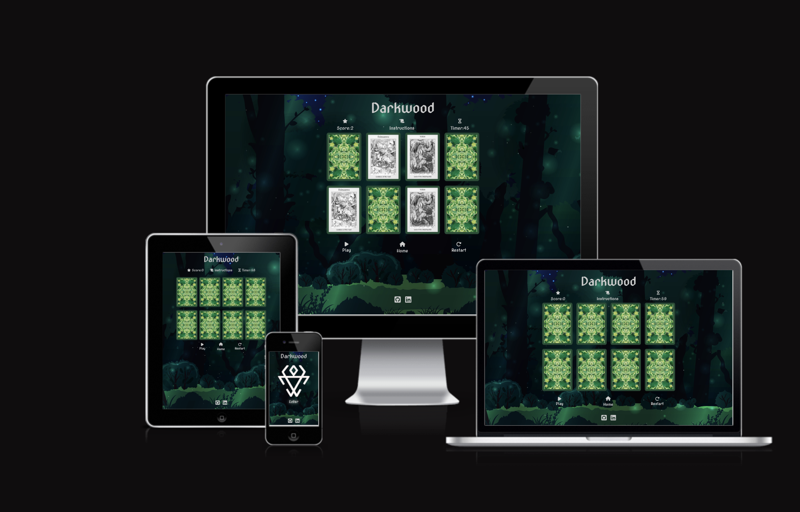
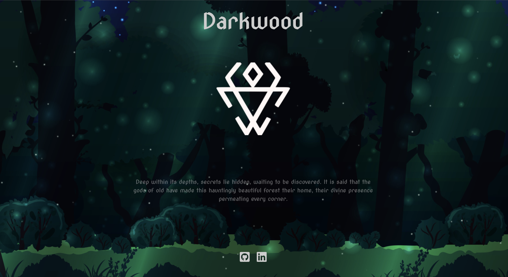
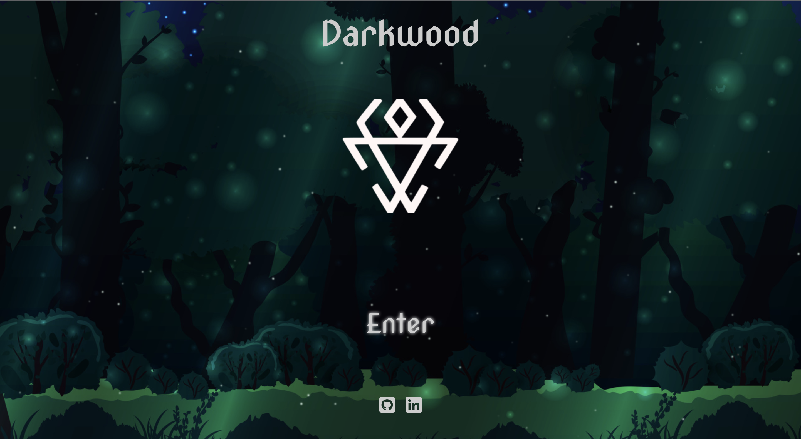
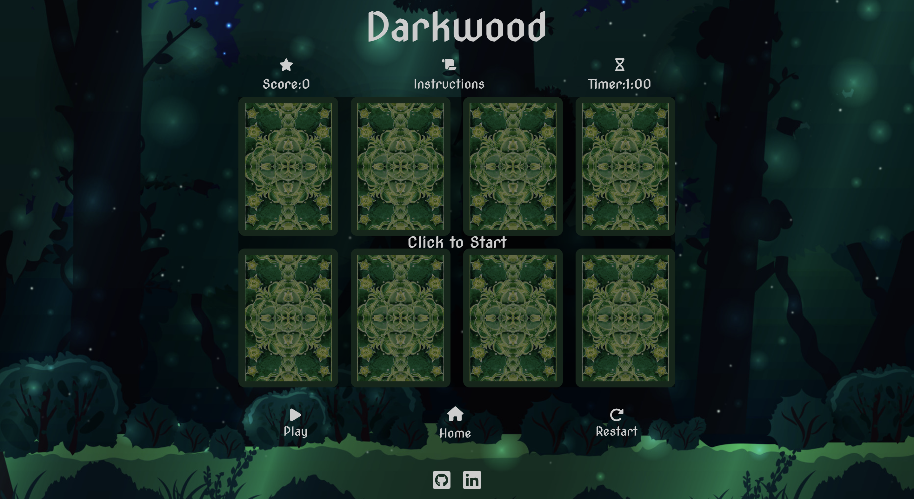
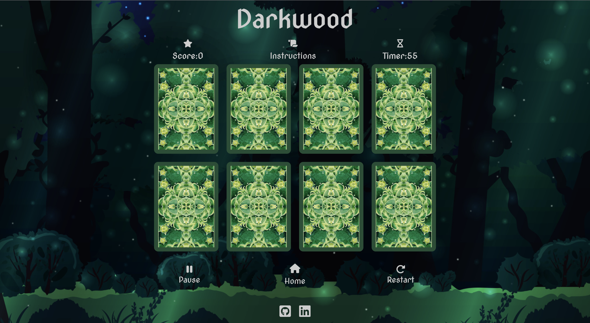
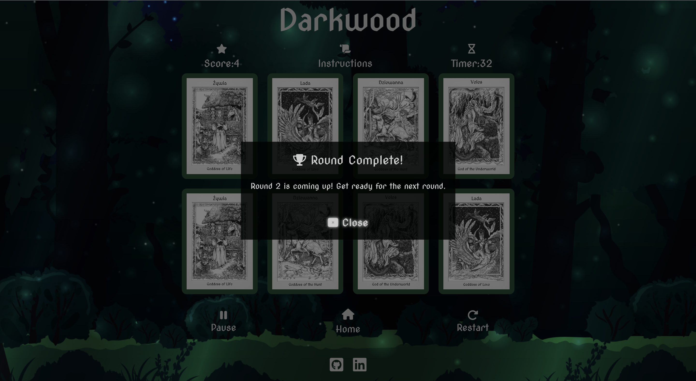
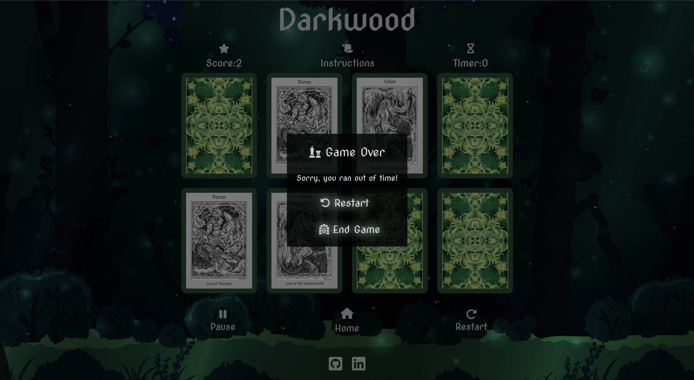

# Darkwood Readme

[Link to Live Site Here](https://emidombek.github.io/darkwood/)
## Table of Contents ## 
- [Darkwood Readme](#darkwood-readme)
  - [Table of Contents](#table-of-contents)
  - [Purpose and goals of the website](#purpose-and-goals-of-the-website)
  - [User stories](#user-stories)
  - [Content and Structure](#content-and-structure)

## Purpose and goals of the website

 - The website aims to provide an immersive and educational gaming experience, engaging players with a Darkwood Slavic Mythology-themed card matching game that entertains, educates, and introduces people to the world of Slavic folklore. 
 - The game is a simple card-matching game where each matched set equals one point. The player's goal is to match all 8 cards before the timer runs out. If the player is successful they progress to the next round and continue to accumulate points for matches.
## User stories

- As a mythology enthusiast, I want to explore and learn about Slavic folklore through a card-matching game.
- As a casual gamer, I want to enjoy a visually appealing card-matching game with a mythology theme.
- As a student studying mythology, I want to be able to learn about mythology in a fun and engaging way.
- As a parent, I want to introduce my children to Slavic mythology through a fun and educational card-matching game.
- As a player, I want to challenge my memory and cognitive skills in a mythology-themed card-matching game.
## Content and Structure

- Custom HTML, Custom CSS, CSS Flexbox, CSS variable roots, CSS Keyframes animations, Custom Javascript
- Github Repo: <https://github.com/emidombek/darkwood>
- Page structure:
     
   1. Landing Page: index.html
   
      - This is a page designed to introduce the user to the feel and atmosphere of the game and to set up the user experience. It also acts as a 'gateway' to the user providing a link to the game at the end of a short animation sequence. 

      - It consists of a Header with the Game Title. The body contains an image of a symbol and a fade-in fade-out fade-in Keyframes animation consisting of two different elements. 

      - An element with some intro text and another element with an entry link for the game. The second link element has an additional Keyframes glow animation designed to highlight and entice the user to click on it.

      - The footer contains a link to my LinkedIn profile as well as my GitHub profile.

      -There is also an animated background (canvas element + js) consisting of small 'fireflies' flying around. The js for this animation and the keyframes fade in-out effects are contained within a separate graphics.js file to the game js which is in the script.js file.  

      

       
Click here to view a screenshot of the Landing Page

       
  
       
  
       

  
   2. Game Page: game.html
   
      - The actual game is located on this page. 

      - When the user first enters the game it load with an overlay and a click-to-start mechanism. After the user clicks on the text the overlay is removed and the game starts.

      - The page itself consists of a Header with the Game Title. There is also a sub-heading container in the header that contains 3 labeled icons that are part of the game elements. These elements are the game score display, an instructions pop-up and a timer for each round.

      - The body consists of a fake 'grid' (a container with columns and rows)+ 2 rows containing, 8 dynamically generated cards in JS in pairs.
   
      - Within the game, there is a total of 16 different cards based on mythological beings from different regions (West, East and Southern Slavic Countries). Each round a new set of 4 matching pairs are placed within the game. Once the user starts the game they must match all 8 cards to progress, if the user runs out of time they will be prompted with a 
  
      - Beneath the 'card grid' there is an instructions-controls container that holds 3 additional elements: an alternating pause/play button (depending on whether the user pauses the game), a home icon with a link back to the index page and a restart button to restart the game completely.
     
      - The footer contains links to my LinkedIn and GitHub profiles.
  
      - This page also uses the same animated background as the entry page. It also uses the keyframes glowing/glow animation to highlight certain clickable icons/text. 

     

       
Click here to view a screenshot of the Game Page Page

       
  
       

       

       

       

  
      

      

  
  

  

