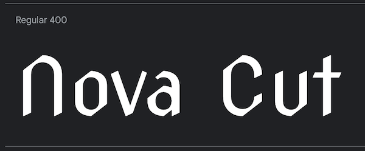

# Darkwood Readme 📚

[Link to Live Site Here](https://emidombek.github.io/darkwood/)
## 📖 Table of Contents ## 
- [Darkwood Readme 📚](#darkwood-readme-)
  - [📖 Table of Contents](#-table-of-contents)
  - [⭐ Purpose and goals of the website](#-purpose-and-goals-of-the-website)
  - [🧑 User stories](#-user-stories)
  - [🗃 Content and Structure](#-content-and-structure)
  - [🖌 Design and Layout](#-design-and-layout)
    - [🌈 Design System](#-design-system)
    - [🔮 Moodboard Concept](#-moodboard-concept)
    - [🖼 Wireframes](#-wireframes)
    - [🃏 Cards](#-cards)
  - [🖥 Technology](#-technology)
  - [🤖 Code](#-code)
    - [🏢 HTML](#-html)
    - [💅 CSS](#-css)
    - [⚙ Javascript](#-javascript)
      - [🌲 graphics.js](#-graphicsjs)
  

## ⭐ Purpose and goals of the website

 - The website aims to provide an immersive and educational gaming experience, engaging players with a Darkwood Slavic Mythology-themed card matching game that entertains, educates, and introduces people to the world of Slavic folklore. 
 - The game is a simple card-matching game where each matched set equals one point. The player's goal is to match all 8 cards before the timer runs out. If the player is successful they progress to the next round and continue to accumulate points for matches.
## 🧑 User stories

- As a mythology enthusiast, I want to explore and learn about Slavic folklore through a card-matching game.
- As a casual gamer, I want to enjoy a visually appealing card-matching game with a mythology theme.
- As a student studying mythology, I want to be able to learn about mythology in a fun and engaging way.
- As a parent, I want to introduce my children to Slavic mythology through a fun and educational card-matching game.
- As a player, I want to challenge my memory and cognitive skills in a mythology-themed card-matching game.
## 🗃 Content and Structure

- Custom HTML, Custom CSS, CSS Flexbox, CSS variable roots, CSS Keyframes animations, Custom Javascript
- Github Repo: <https://github.com/emidombek/darkwood>
- Page structure:
     
   1. Landing Page: index.html
   
      - This is a page designed to introduce the user to the feel and atmosphere of the game and to set up the user experience. It also acts as a 'gateway' to the user providing a link to the game at the end of a short animation sequence. 

      - It consists of a Header with the Game Title. The body contains an image of a symbol and a fade-in fade-out fade-in Keyframes animation consisting of two different elements. 

      - An element with some intro text and another element with an entry link for the game. The second link element has an additional Keyframes glow animation designed to highlight and entice the user to click on it.

      - The footer contains a link to my LinkedIn profile as well as my GitHub profile.

      - There is also an animated background (canvas element + js) consisting of small 'fireflies' flying around. The js for this animation and the keyframes fade in-out effects are contained within a separate graphics.js file to the game js which is in the script.js file.  

      

       
Click here to view a screenshot of the Landing Page

       
  
       
  
       

  
   2. Game Page: game.html
   
      - The actual game is located on this page. 

      - When the user first enters the game it load with an overlay and a click-to-start mechanism. After the user clicks on the text the overlay is removed and the game starts.

      - The page itself consists of a Header with the Game Title. There is also a sub-heading container in the header that contains 3 labeled icons that are part of the game elements. These elements are the game score display, an instructions pop-up and a timer for each round.

      - The body consists of a fake 'grid' (a container with columns and rows)+ 2 rows containing, 8 dynamically generated cards in JS in pairs.
   
      - Within the game, there is a total of 16 different cards based on mythological beings from different regions (West, East and Southern Slavic Countries). Each round a new set of 4 matching pairs are placed within the game. Once the user starts the game they must match all 8 cards to progress, if the user runs out of time they will be prompted with a 
  
      - Beneath the 'card grid' there is an instructions-controls container that holds 3 additional elements: an alternating pause/play button (depending on whether the user pauses the game), a home icon with a link back to the index page and a restart button to restart the game completely.
     
      - The footer contains links to my LinkedIn and GitHub profiles.
  
      - This page also uses the same animated background as the entry page. It also uses the keyframes glowing/glow animation to highlight certain clickable icons/text. 

      

       
Click here to view a screenshot of the Game Page

       
  
       

       

       

       

## 🖌 Design and Layout

 The design and layout of this website was created in Figma. A moodboard and wireframes were designed from scratch to help develop the look and feel of the game. Keyframes animations help emphasize important links and icons. Javascript for the background and Keyframes animations are stored in a different graphics.js file than the actual game code which is located in script.js. The setting of the game is inspired by Slavic mythology and the Witcher games/tv series/books.

   ### 🌈 Design System

   

       
Click here to view the Elements of the Design System

   
       *Color Palette*

       

       *Font*

       

       Nova Cut 400 imported from [Google Fonts](https://fonts.google.com/specimen/Nova+Cut)

       *Iconography*

       

       Icons are taken from [Font Awesome](https://fontawesome.com/)

   

   ### 🔮 Moodboard Concept

   

       
Click here to view the Moodboard and Concept

       

   

  
   ### 🖼 Wireframes 

   [Link to Wireframes in Figma](https://www.figma.com/file/xfQpobp6FbpuhwTs9gPaX5/Darkwood-Memory-Card-Game?type=design&node-id=0%3A1&mode=design&t=QpLt1hLRtOcsTnLt-1)

   

       
Click here to view the Wireframes

       Landing Page Wireframe:

       

       Game page Wireframe:

       

   

   ### 🃏 Cards

   

       
Click here to view the Cards

       Entire Deck:

       

       Card Back:

       

   

   The front and back of the cards are taken from two artists under a private/personal use license, permission obtained from each one to make sure:

   - Front (Back ingame) of the cards: *Slavic Pantheon* [Hanna Dola Art](https://www.behance.net/hannadolaart/assets)
   - Back (Front ingame) of the cards: *Playing Cards* [Losenko](https://www.deviantart.com/losenko) 
  
## 🖥 Technology

 The technology used in this project is as follows:

   - [CSS](https://en.wikipedia.org/wiki/CSS) - style sheet language used to style the webpages.
   - [HTML](https://en.wikipedia.org/wiki/HTML) - standard markup language.
   - [Javascript](https://en.wikipedia.org/wiki/JavaScript) - a programming language used on the client side of web applications.
   - [Code Institute Repo Template](https://github.com/Code-Institute-Org/ci-full-template) - GitHub repository template used to create the repository.
   - [Visual Studio Code](https://code.visualstudio.com/) - source code editor used to create, edit and publish the webpages with the assistance of Git/GitHub/GitPages.
   - [Figma](https://www.figma.com/) - cloud-based design tool I used to create the wireframes and moodboard.
   - [Git](https://en.wikipedia.org/wiki/Git) - distributed version control system.
   - [GitHub](https://github.com/) - Git repository hosting service with a web-based graphical interface.
   - [Gitpages](https://docs.github.com/en/pages/getting-started-with-github-pages/about-github-pages)- GitHub Pages is a static site hosting service.
## 🤖 Code

 The majority of this game is written in custom Javascript, with custom CSS + Keyframes animations for styling as well as custom HTML. 

   ### 🏢 HTML

   The HTML used is a pretty standard implementation for both the index.html page and the game.html it includes a Head, Header, Body and Footer for each page. The index.html serves as an entry point for the game.html displaying a p element entry text that reveals an entry link element to the user via a CSS/Javascript keyframes animation sequence. 
   
   

   
HTML Summary

  
   - The game.html page has containers that hold the game features and links: a Score icon/text with a span to display the game score, an icon with a pop-up trigger that triggers a pop-up containing game instructions and a timer icon with a span that displays the time remaining in the current round at the top. The main section holds the fake 'grid' or just a container with rows and grid game rows that hold the eight cards that are generated dynamically in Javascript. Below the card containers, there is another container with some controls and a link: the play/pause icon/text is a span that is toggled via JS depending on the game state function currently active, a home icon/text that contains a link back to the index Landing Page and a restart icon/text that triggers the restart game function in JS. The social media list items in the footer of both pages were taken from the Love Running project which will be listed in the resources below.

   - A highlight of the HTML implementation of the **canvas** element on both pages which is used to facilitate the display of the background 'Firefly' Javascript animation.

   - Another highlight of the HTML is the elements on the index.html which facilitate the fade-in fade-out fade-in keyframes animation sequence.

   - The game.html page besides holding the containers for the dynamically created cards and game controls + displays and links has containers that hold several pop-ups that are further styled and controlled in the script.js file. 
    
   

   ### 💅 CSS

   The CSS for this game is pretty standard located inside the style.css file. The root variables define various colors, font families, and line height to maintain consistency throughout the game. At the top of the file it imports the Nova Cut font from google fonts.

   

   
CSS Summary

   - The CSS includes global styles for the body, main, and header elements, setting the background image and layout. It also configures the **canvas** element for firefly-like graphics animation found in the graphics.js file. There is also a setting at the very top that removes global settings (credit to my mentor Juliia). 
  
   - Highlights of the CSS include some elements including being styled to be initially hidden to facilitate various effects:

    1. .entry-link: The "Enter" link on the entry page is initially hidden. It becomes visible later with a fade-in effect.
    2. .hidden: This class is used to hide elements. It's not directly applied to any specific element in the given CSS, but it's likely used in JavaScript or dynamically added to elements for certain interactions.
    3. .fa-play: The play icon used in pop-up elements is initially hidden.
    4. #playText: This element, likely a text label for the play icon, is initially hidden.
  
   - The CSS file also defines animations via Keyframes for fade-in and glowing effects on elements. Resources for the Keyframes animations will be listed below.
   
   

   ### ⚙ Javascript

   The Javascript in this project is divided into two different files, the first file is the *graphics.js* file where the background fireflies animation is created and Keyframes fade-in fade-out sequence is controlled. This file is used on both of the web pages. The second file script.js is where the actual code that runs the game lives. This file is only used within the game.html webpage. 

   #### 🌲 graphics.js

   The entire code is wrapped in a 'DOMContentLoaded' event listener to ensure that the JavaScript code inside the event listener runs only after the DOM has been fully loaded and parsed.

   

   
Control Fade-In Fade-Out Fade-In Keyframes Sequence

   

   - Initially, both fadeElement and entryLink have the "hidden" class applied to them, which sets their opacity property to 0 in the CSS, making them invisible on the webpage.

   - When the page loads and the DOMContentLoaded event fires, the JavaScript sets up an animationend event listener on fadeElement.

   - When fadeElement finishes its animation (a fade-out effect, for example), the animationend event is triggered.

   - In the event listener callback function, the JavaScript code executes and adds the "hidden" class back to fadeElement using fadeElement.classList.add("hidden");.

   - However, before this step, the code also sets up another event listener for the animationend event on entryLink.

   - When fadeElement finishes its animation, the animationend event listener on entryLink triggers as well.

   - In the event listener callback function for entryLink, the JavaScript code executes and removes the "hidden" class from entryLink using entryLink.classList.remove("hidden");.

   - By removing the "hidden" class from entryLink, the CSS transition now applies to it, and its opacity is gradually changed from 0 to 1 over time, creating the fade-in effect for the link.

   - So, both fadeElement and entryLink have separate animationend event listeners, but the removal of the "hidden" class from entryLink occurs in its own event listener and is essential for triggering the fade-in animation for the link.  
   
   

   

   
Firefly Back Animation

   The majority of this code was taken from: https://github.com/owentr1369/animated-background-fireflies-youtube and modified.

   [SVG Flowchart of the entire graphics.js file](https://github.com/emidombek/darkwood/blob/main/docs/images/graphicsjsfull.svg)

   Summary of the code:

   1. The code defines a Firefly class that represents a firefly's behavior on a canvas. It has methods to update its position and display on the canvas.

   2. Variables canvas, context, w, and h are declared to handle the canvas and its drawing context.

   3. An array f is created to store firefly objects.

   4. The draw() function manages the animation loop for the fireflies, adding new fireflies and removing those outside the canvas.

   5. The init(elemid) function sets up the canvas, fills it with a light green color, and returns the drawing context for further drawing operations.

   6. The loop() function sets up the animation loop using window.requestAnimationFrame to repeatedly clear the canvas and render the animation.

   7. The window.resize event listener updates the canvas size when the window is resized, reinitializes the canvas, and restarts the animation loop to reflect the changes.

   8. Finally, the code initializes the canvas and starts the animation loop.

   The code creates a simulation of fireflies flying around on a canvas, and the fireflies move randomly within the canvas boundaries. The animation loop ensures a smooth visual effect, and fireflies are added or removed as needed to maintain the desired number of fireflies on the canvas.

   Here is a list of what was modified:

   9. Variable names:
      - Original: Uses c as the canvas context variable and returns it from the init function.
      - My edit: Uses context for the canvas context variable and returns it from the init function. It was easier to make sense of it going back to read it.

   10. Typo in move method: 
      - Original: Contains a typo (this.and) when updating the angle of movement, should be this.ang.
      - My edit: Fixed the typo.

   11. Mouse movement tracking: 
      - Original: The original code includes event listeners to track the mouse position and store it in mouse and last_mouse variables. Also includes mouse movement tracking using event listeners to store mouse coordinates.
      - My edit: Removed the mouse movement tracking event listeners because they were causing issues with the animation loading and I could not figure out what exactly was causing it. This also makes the animation purely self-contained and autonomous, meaning it will generate the firefly animation without any external input.

   12. Canvas initialization and animation loop:
      - Original: Uses setInterval for animation loop (60 FPS).
      - My edit: Uses window.requestAnimationFrame for animation loop. It provides a more efficient and optimized approach for achieving smooth animations while also being mindful of performance and battery life.

   13. Background fill color:
     - Original: Sets the canvas background fill color to a dark gray (rgba(30, 30, 30, 1)).
     - First Post: Sets the canvas background fill color to a light green (rgba(152, 255, 191, 1)).

   

   

         
      

  

   

  

  
      

      

  
  

  

